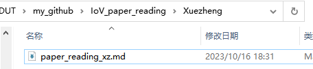
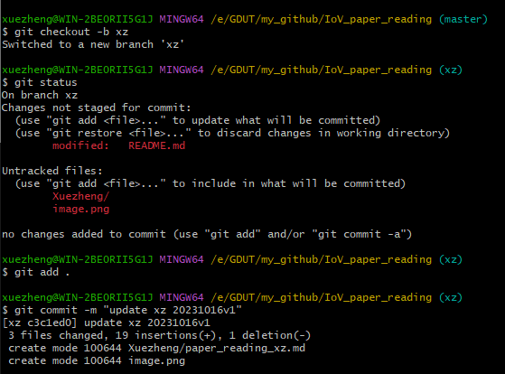
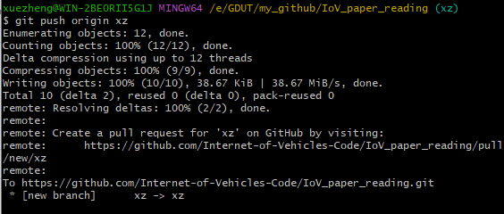
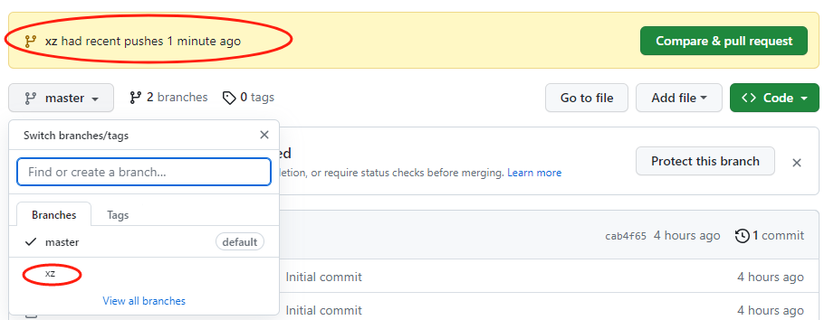
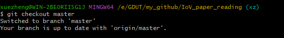
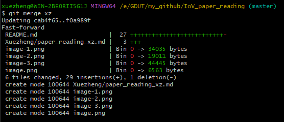
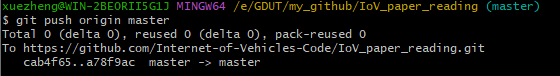

# IoV_paper_reading

本项目用于记录相关文献的阅读。

Our mission is to promote the security of Internet of Vehicles and autonomous driving.

People working on the paper reading program:
- [Zheng Xue](./Xuezheng/paper_reading_xz.md)
- [Yurong Zhang](./Zhangyurong/paper_reading_zyr.md)
- [Hongmin Wei](./Weihongmin/paper_reading_whm.md)

## 使用指南
- (可参考[知乎：多人合作使用git，推送代码、和并分支](https://zhuanlan.zhihu.com/p/96518956#:~:text=%E5%8E%9F%E6%96%87%E5%9C%B0%E5%9D%80%EF%BC%9A%E5%A4%9A%E4%BA%BA%E5%90%88%E4%BD%9C%E4%BD%BF%E7%94%A8git%EF%BC%8C%E6%8E%A8%E9%80%81%E4%BB%A3%E7%A0%81%E3%80%81%E5%92%8C%E5%B9%B6%E5%88%86%E6%94%AF,%E4%B8%8B%E9%9D%A2%E5%B0%86%E4%BC%9A%E6%BC%94%E7%A4%BA%E5%A4%9A%E4%BA%BA%E5%90%88%E4%BD%9C%E5%86%99%E9%A1%B9%E7%9B%AE%E4%BD%BF%E7%94%A8git%E7%9A%84%E6%95%99%E7%A8%8B%EF%BC%9A%E5%88%9B%E5%BB%BA%E5%88%86%E6%94%AF%E3%80%81%E6%8E%A8%E9%80%81%E4%BB%A3%E7%A0%81%E3%80%81%E5%B0%86%E8%87%AA%E5%B7%B1%E7%9A%84%E5%88%86%E6%94%AF%E7%9A%84%E4%BB%A3%E7%A0%81%E5%92%8C%E4%B8%BB%E5%88%86%E6%94%AF%E5%90%88%E5%B9%B6%E3%80%82%20%E4%B8%8B%E9%9D%A2%E6%98%AF%E6%A8%A1%E4%BB%BF%E4%B8%A4%E4%B8%AA%E4%BA%BA%E5%90%88%E4%BD%9C%EF%BC%8C%E6%AF%8F%E4%B8%AA%E4%BA%BA%E4%B8%80%E4%B8%AA%E5%88%86%E6%94%AF%EF%BC%8C%E7%84%B6%E5%90%8E%E4%B8%80%E4%B8%AA%E4%B8%BB%E5%88%86%E6%94%AF1%E3%80%81%E5%88%9B%E2%80%A6))
1. 安装[Git](https://git-scm.com/)
   
2. 克隆本项目
   ```
   git clone https://github.com/Internet-of-Vehicles-Code/IoV_paper_reading.git
   ```
   (如果是手动下载，需要先初始化仓库
   ```
   git init
   ```
   随后建立分支，push前需要建立和远程仓库的链接
   ```
   git remote add origin https://github.com/Internet-of-Vehicles-Code/IoV_paper_reading.git
   ```
   )
3. 新建自己的文件夹及对应的markdown文件
   
   
4. 更新自己的论文阅读部分
5. 创建一个本地分支并推送到创建的新分支xz
   ```
   git checkout -b xz
   ```
   
   
   
6. 切换到主分支合并代码
   ```
   git checkout master
   ```
   ```
   git merge xz
   ```
   
   
7. 推送到主分支
   ```
   git push origin master
   ```
   