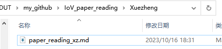

# IoV_paper_reading

本项目用于记录相关文献的阅读

## 使用指南
1. 安装[Git](https://git-scm.com/)
   
2. 克隆本项目
   ```
   git clone https://github.com/Internet-of-Vehicles-Code/IoV_paper_reading.git
   ```
3. 新建自己的文件夹及对应的markdown文件
   
   
4. 更新自己的论文阅读部分
5. 