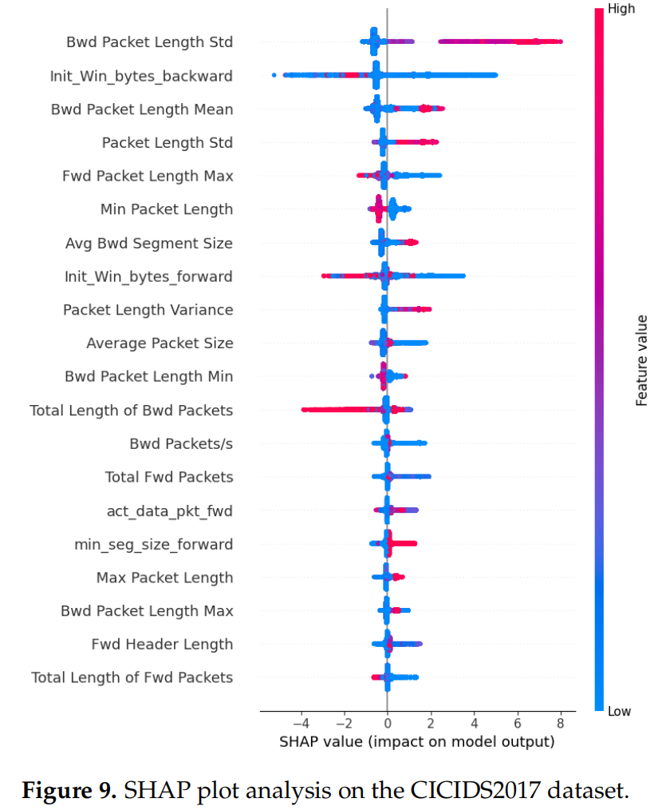
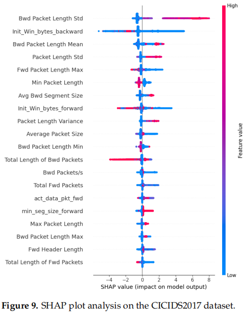

# Paper-Reading

Paper reading list in Cooperative perception. This repository will keep updating ... 🤗
- **L. Yang, A. Moubayed and A. Shami, "MTH-IDS: A Multitiered Hybrid Intrusion Detection System for Internet of Vehicles," in IEEE Internet of Things Journal, vol. 9, no. 1, pp. 616-632, 1 Jan.1, 2022, doi: 10.1109/JIOT.2021.3084796.[[paper]](https://ieeexplore.ieee.org/document/9443234)**

- **L. Yang, A. Shami, G. Stevens and S. de Rusett, "LCCDE: A Decision-Based Ensemble Framework for Intrusion Detection in The Internet of Vehicles," GLOBECOM 2022 - 2022 IEEE Global Communications Conference, Rio de Janeiro, Brazil, 2022, pp. 3545-3550, doi: 10.1109/GLOBECOM48099.2022.10001280.[[paper]](https://ieeexplore.ieee.org/document/10001280)**

- **L. Yang and A. Shami, "A Transfer Learning and Optimized CNN Based Intrusion Detection System for Internet of Vehicles," ICC 2022 - IEEE International Conference on Communications, Seoul, Korea, Republic of, 2022, pp. 2774-2779, doi: 10.1109/ICC45855.2022.9838780.[[paper]](https://ieeexplore.ieee.org/document/9838780)[[code]](https://github.com/Western-OC2-Lab/Intrusion-Detection-System-Using-CNN-and-Transfer-Learning)[[笔记]](<../../../车联网安全/detection/A Transfer Learning and Optimized CNN Based.docx>)**
   ```
   注：ICC 2022
   1. 研究背景与目的：
      - 现代车辆，包括自动驾驶和联网车辆，越来越多地连接到外部世界，这增加了车联网（IoV）的网络攻击面，使其更容易受到网络威胁。
      - 由于车载网络缺乏认证和加密程序，入侵检测系统（IDS）是保护现代车辆系统免受网络攻击的重要方法。
   2. 方法论：
      - 提出了一种基于迁移学习和集成学习的IoV系统IDS，使用卷积神经网络（CNN）和超参数优化技术。
      - 在实验中，所提出的IDS在两个知名的公共基准IoV安全数据集上展示了超过99.25%的检测率和F1分数。
   3. 创新点：
      - 提出了一种新的框架，通过CNN、迁移学习、集成学习和超参数优化技术有效检测车内外网络的网络攻击。
      - 提出了一种数据转换方法，将车辆网络流量数据有效地转换为图像，以便更容易区分各种网络攻击模式。
      - 在两个代表车内外网络数据的基准网络安全数据集上评估了所提出方法的性能，并与其他最先进的方法进行了比较。
   4. 具体实现步骤：
      - 收集车内外网络数据，将其转换为基于时间块的图像。
      - 使用五种先进的CNN模型（VGG16、VGG19、Xception、Inception和InceptionResnet）训练基础学习器。
      - 使用粒子群优化（PSO）方法优化CNN模型的超参数。
      - 选择表现最佳的三个CNN模型作为基础CNN模型，构建集成学习模型。
      - 使用置信度平均和连接两种集成策略构建最终的检测模型。
   ```
- **薛宏伟.面向智能网联汽车的网络异常行为检测方法研究[D].东南大学,2021.DOI:10.27014/d.cnki.gdnau.2021.003115.[[paper]](https://kns.cnki.net/kcms2/article/abstract?v=yXT3uqWUX_-EDYP8LlA_mRorFVKfBHHJrzWvS9fHYuoFr84ZLVzX7GlDsnYFC0mT0mGXCXuae48zN2SBO9kC2ZwNpRwGz-dAk7if5vbghPdk39wRBcz_pAeQcMYTFXItFc9MiH0jSfrNKzjqucus7Q==&uniplatform=NZKPT&language=CHS)[[笔记]](<../../../车联网安全/detection/V2X Misbehavior Detection/面向智能网联汽车的网络异常行为检测方法研究note.md>)**
   ```
   注：2021年  
   核心内容：
   1. 异常行为检测方法：
      - 基于密码学的方法
      - 基于异常行为检测的方法，包括以节点为中心（Node-centric MDS）和以数据为中心（Data-centric MDS）的检测。
   2. 智能网联汽车网络安全模型建立：
      - 交通仿真模型
      - 车联网通信模块，包括通信数据格式的重新定义，考虑了位置、速度、加速度和航向的误差。
      - 网络攻击模式，包括单一攻击（拒绝服务、女巫攻击、重放攻击）和复合性攻击（DDS攻击）。
      - 智能网联汽车网络安全联合仿真，使用Veins和OMNeT++进行仿真。
   3. 基于Stacking集成学习的车联网异常行为检测方法：
      - 异常行为检测架构
      - 数据清洗和特征值筛选
      - 模型训练与测试
      - 使用常用评价指标（Accuracy、Precision、Recall、F1-Score）进行评估。
   4. 基于GAN网络的车联网异常行为检测方法：
      - 利用生成对抗式网络（GAN）学习Replay攻击的潜在分布，生成大量带标签的Replay攻击数据。
      - 通过GAN网络生成对抗样本，解决数据集中正常行为样本和异常行为样本数量不平衡的问题。
      - 性能比较，提出的方法在准确率、精确率和F1-Score上有所提升。
   5. 智能网联汽车的网络异常行为检测系统设计及实现：
      - 系统整体架构
      - 车载平台设计，包括在线和离线工作模式。
      - 云控平台设计，基于HTTP协议，实现全局网络状态分析。
      - 可视化模块设计，包括web界面和SUMO界面。
   6. 总结与展望：
      - 本文研究了智能网联汽车的网络攻击和异常行为检测方法。
      - 提出了基于Stacking集成学习和GAN网络的检测方法。
      - 未来研究可以扩展更多攻击方式，优化算法检测效果，并尝试引入深度卷积神经网络和更换损失函数以提升模型性能。
   ```
- **K. Agrawal, T. Alladi, A. Agrawal, V. Chamola and A. Benslimane, "NovelADS: A Novel Anomaly Detection System for Intra-Vehicular Networks," in IEEE Transactions on Intelligent Transportation Systems, vol. 23, no. 11, pp. 22596-22606, Nov. 2022, doi: 10.1109/TITS.2022.3146024.[[paper]](https://ieeexplore.ieee.org/document/9706416)[[code]](https://github.com/kushagra-2503/Artificial-Intelligence-Enabled-SecurityProvisioning-for-Autonomous-Vehicles)**
   ```
   注：TITS.2022
   1. 数据集：CAN-INTRUSION-DATASET
      - DoS attack
      - fuzzy attacks
      - gear attack
      - rpm attack
   2. 模型选择：
      - 正在使用的模型：Stacked LSTMS 和 CNN LSTMS
      - 对 6 个模型进行了实验：
         - 单层 LSTM
         - CNN + 单层 LSTM
         - 两层 LSTM
         - 三层 LSTM
         - 带 CNN 的三层 LSTM
         - 带 CNN 的四层 LSTM

   ```

- **A. Boualouache and T. Engel, "A Survey on Machine Learning-Based Misbehavior Detection Systems for 5G and Beyond Vehicular Networks," in IEEE Communications Surveys & Tutorials, vol. 25, no. 2, pp. 1128-1172, Secondquarter 2023, doi: 10.1109/COMST.2023.3236448.[[paper]](https://ieeexplore.ieee.org/document/10015746)**
   ```
   注：IEEE Communications Surveys & Tutorials 2023
      这是一篇综述
   - 目前车联网MBDS攻击检测系统方案：
   1. 传统机器学习
   - 监督学习中的分类问题：朴素贝叶斯（NB）、Logistic回归（LR）、支持向量机（SVM）、k最近邻（KNN）、随机森林（RF）、人工神经网络（ANN）、额外树（ET）、AdaBoost、决策树桩、集成学习（bagging, boosting, stacking）、XGBoost、光梯度增强机（LGBM）
   - 无监督学习：异常检测、聚类和降维。常见的聚类算法是k均值模型、层次模型和高斯混合模型。常见的异常检测算法有椭圆包络算法、隔离森林算法、单类SVM算法。
   2. 深度学习
   - 监督学习：卷积神经网络（CNN）、递归神经网络（RNN）
   3. 高级机器学习概念
   - 联邦学习、强化学习、迁移学习、半监督学习、生成式对抗性网络（GAN）、线上学习
   ```
- **F. Dutra, K. Bonfim, C. Siqueira, L. A. Pereira, A. Santos and R. I. Meneguette, "DISMISS-BSM: an Architecture for Detecting Position Spoofing in Basic Safety Messages," GLOBECOM 2022 - 2022 IEEE Global Communications Conference, Rio de Janeiro, Brazil, 2022, pp. 3381-3386, doi: 10.1109/GLOBECOM48099.2022.10001122.[[paper]](https://ieeexplore.ieee.org/document/10001122)[[code]](https://github.com/c2dc/dismiss-bsm-globecom2022)**

   ```
   注：GLOBECOM.2022（MBDS检测）
   ```

- **K. A. Bonfim, F. D. S. Dutra, C. E. T. Siqueira, R. I. Meneguette, A. L. Dos Santos and L. A. P. Júnior, "Federated Learning-based Architecture for Detecting Position Spoofing in Basic Safety Messages," 2023 IEEE 97th Vehicular Technology Conference (VTC2023-Spring), Florence, Italy, 2023, pp. 1-5, doi: 10.1109/VTC2023-Spring57618.2023.10199980.[[paper]](https://ieeexplore.ieee.org/document/10199980)[[code]](https://github.com/c2dc/fl-bsm-vtc2023)**

   ```
   注：VTC2023-Spring（MBDS检测）
   ```
- **Misbehavior detection in intelligent transportation systems based on federated learning.
[[paper]](https://www.sciencedirect.com/science/article/pii/S2542660524000696)[[code]](https://github.com/Enrique-Marmol/Decentralized_Misbehavior_Detection_based_on_FL_for_Intelligent_Transportation_Systems)[[笔记]](<../../../车联网安全/detection/V2X Misbehavior Detection/2024_3区_基于联邦学习的智能交通系统中的不当行为检测.docx>)**
   ```
   注：2024年3区                                                     
   文章的创新点：
   1. 联邦学习的应用：文章提出了一种基于联邦学习的协作学习方法，用于车辆不当行为的检测。这种方法允许车辆在不共享其数据的情况下，通过本地训练更新全局模型，从而解决了传统集中式机器学习（ML）方法可能带来的隐私问题和高延迟问题。
   2. 数据集的重新平衡：文章使用了VeReMi数据集，并应用了SMOTE-Tomek技术来重新平衡数据集，以解决数据集中的类别不平衡问题。这种方法结合了过采样和欠采样，以确保每个类别的样本数量相对均衡，从而提高模型的泛化能力。
   3. 多层感知器（MLP）的优化：文章使用了优化的多层感知器（MLP）作为ML模型，并结合了FedAvg和Fed+两种聚合函数来评估模型性能。Fed+方法特别适用于处理非独立同分布（non-iid）的数据，这在实际的车辆通信场景中很常见。
   4. 模型性能评估：文章不仅使用了传统的准确率（accuracy）、召回率（recall）、精确率（precision）和F1分数等指标，还引入了Matthew相关系数（MCC）和Cohen's Kappa Score（CKS）来更全面地评估模型性能，特别是在类别不平衡的情况下。
   5. 同时，FL数据集划分通过id进行划分，比随机将数据集人为划分为多个数据集更加符合真实场景。
   ```
😊😊（读过忘了）
- **A stacked ensemble learning IDS model forSoftware-defined VANET.[[paper]](https://arxiv.org/abs/2312.04956)**
   ```
   注：2023年12月14日发表 
   1. 研究背景与目的：
      - 针对软件定义的车载自组织网络（SDN-based VANET）中的入侵检测系统（IDS）进行研究，以提高对网络安全事件的检测和缓解能力。
      - 随着连接自动驾驶车辆（CAVs）的发展，评估传统IDS方法在新兴技术中的应用变得至关重要。
   2. 方法论：
      - 提出了一种堆叠集成学习方法，结合多种机器学习算法，以比单一算法方法更有效地检测威胁。
      - 使用CICIDS2017和VeReMi基准数据集进行性能比较，发现该方法在识别威胁方面更准确。
      - 方法还包括超参数优化和特征选择，以进一步提高性能。
   3. 结果与评估：
      - 研究结果表明，堆叠集成学习是一种有前景的技术，可以增强IDS的有效性。
      - 在CICIDS2017和VeReMi数据集上进行了二元和多类分类模型的性能评估，取得了高准确率、精确度、召回率和F1分数。
   4. 实施挑战与经验：
      - 在分类阶段，处理时间和硬件容量是主要挑战。
      - 提出了在SDN控制器中实施IDS解决方案的一般方法。
   5. 创新点：
      - 提出了一种新的SDN-based VANET异常检测模型，结合了不同的机器学习方法。
      - 实施了三阶段集成方法，减少了推断攻击的风险，并在小规模攻击上表现良好。
   6. 实施步骤：
      - 数据清洗和准备：处理缺失值，进行特征归一化。
      - 特征选择：使用SelectKBest类和卡方统计测试选择最佳特征。
      - 超参数优化：使用贝叶斯优化与高斯过程进行参数优化。
      - 集成堆叠分类器：使用随机森林（RF）和XGBoost作为基础学习器，逻辑回归（LR）作为最终学习器。
   ```
- **Federated Learning for V2X Misbehavior Detection System in 5G Edge Networks.[[paper]](https://dl.acm.org/doi/10.1145/3616388.3617533)**
   ```
   注：2023年10月30日至11月3日在国际ACM建模、分析和模拟无线与移动系统会议（MSWiM）上发表
   1. 研究背景与目的：
      - 5G蜂窝车联网（C-V2X）的出现为车联网（V2X）通信提供了主要技术，为电信服务提供商提供了利用现有5G网络基础设施的机会，以提供车到网络（V2N）服务。
      - 本文提出了一种新方法，通过在5G核心网络中实施联邦学习（Federated Learning）V2X不良行为检测系统，增强5G V2N服务的安全性。
   2. 方法论：
      - 提出的系统旨在保护位于5G边缘网络中的V2X应用服务器（V2X ASs）免受潜在的V2X攻击，同时利用联邦学习的隐私和可扩展性优势。
      - 通过广泛的仿真，将提出的模型与其他集中式和分布式方法进行比较，取得了优异的结果，证明了其部署的可行性。
   3. 结果与评估：
      - 提出的模型在准确性、精确度和检测率方面表现突出，分别达到了98.4%、99.3%和96.9%。
   4. 创新点：
      - 提出了一种基于长短期记忆（LSTM）和联邦学习的分布式不良行为检测系统，节点安装在5G边缘网络中，以保护边缘、云或互联网上托管的C-ITS应用服务器。
      - 利用联邦学习的可扩展性，解决了大规模部署中V2X不良行为检测的挑战。
   5. 具体实施步骤：
      - 在5G边缘网络中部署多个不良行为检测功能（MDFs）实例。
      - MDFs负责实时处理和监控V2N流量数据包，并将本地模型参数与联邦学习中心（FL-C）服务器共享，而不共享本地训练数据。
      - FL-C服务器作为中心枢纽，组织和编译从MDF实例接收到的改进机器学习模型，实现协作学习。
      - 在检测到攻击时，不良行为报告功能（MRF）可以启动流量引导请求，将攻击者的流量重定向到蜜罐服务器，保护应用免受伪造数据的影响。
   ```
- **An Amalgamated Novel IDS Model for Misbehaviour Detection using VeReMiNet.[[paper]](https://www.sciencedirect.com/science/article/pii/S0920548923000648)**
   ```
   注：2024年 2区《Computer Standards & Interfaces》
   1. 研究背景与目的：
      - 车辆自组织网络（VANETs）在智能交通系统（ITS）中越来越受欢迎，因为它们可以提高交通效率和道路安全。
      - 研究重点在于检测VANETs中传播虚假车辆信息（位置、时间、速度和车辆ID）的恶意节点，这些行为可能威胁网络安全和隐私，导致事故、碰撞和交通拥堵。
   2. 方法论：
      - 提出了一种基于深度学习（DL）的新方法，用于自动识别VANETs中的位置伪造攻击，以发现数据中的隐藏模式，对抗已知和新出现的威胁。
      - 使用公开可访问的VeReMi数据集评估方法，展示了高达99.55%的高检测准确率。
   3. 创新点：
      - 提出了一种新的DL驱动方法，自动检测基本安全消息中的威胁，与现有方法不同，后者仅使用单个基本安全消息的训练方面。
      - 提出了一种特征选择方法，使用教学-学习基础的海洋捕食者算法（MPA）进行特征选择，以提高检测精度。
      - 开发了一种深度学习模型，使用VeReMiNet准确分类所有类型的攻击。
   4. 具体实现步骤：
      - 初始化阶段：随机分配特征子集，计算每个特征子集的适应度，并创建精英和猎物矩阵。
      - 探索阶段：根据适应度值选择精英捕食者，并根据精英捕食者的位置调整捕食者的位置。
      - 捕食者和猎物速度相同（开发与探索）：在优化的中间阶段，捕食者和猎物以相同的速度移动，进行狩猎。
      - 猎物速度超过捕食者（开发）：在这个阶段，猎物通过Lévy飞行模式进行捕食，捕食者则通过Brownian运动进行捕食。
      - 海洋记忆捕食者：捕食者根据精英和猎物矩阵的适应度评估来改变精英，应用FADs（鱼群聚集装置）影响。
      - 分类使用VeReMiNet：使用深度学习模型对攻击进行分类，包括二元分类和多类分类。
   ```
- **R. Sedar, C. Kalalas, P. Dini, J. Alonso–Zarate and F. Vázquez–Gallego, "Misbehavior Detection in Vehicular Networks: An Ensemble Learning Approach," GLOBECOM 2022 - 2022 IEEE Global Communications Conference, Rio de Janeiro, Brazil, 2022, pp. 1850-1855, doi: 10.1109/GLOBECOM48099.2022.10001264.
[[paper]](https://ieeexplore.ieee.org/document/10001264)**
   ```
   注：GLOBECOM 2022
   1. 研究背景与目的：
      - 随着车联网（V2X）系统的兴起，需要新的机制来应对安全漏洞和安全威胁。
      - 本文介绍了一种数据驱动的集成框架，结合聚类和强化学习来检测未标记车辆数据中的不良行为。
   2. 方法论：
      - 提出了一种新的集成学习框架，用于V2X不良行为检测，该框架包括一个无监督学习层用于从未标记的V2X交通轨迹中发现隐藏模式，以及一个强化学习（RL）层，用于在未知的V2X环境中不断提高检测经验，而不依赖于安全阈值。
      - 使用K-means算法进行聚类和注释数据实例，然后训练一个基于RL的检测器来区分正常车辆和不良行为车辆。
   3. 创新点：
      - 结合了无监督学习和强化学习来处理未标记的数据，提高了对未知攻击模式的检测能力。
      - 在V2X环境中，通过实时反馈（奖励/惩罚）来学习最优的检测策略，使检测更加鲁棒，减少了对噪声训练数据的敏感性。
   4. 具体实现步骤：
      - 从原始V2X数据中检索消息（包括正常和攻击信息）。
      - 消息预处理，提取各种不良行为攻击类型的特征向量。
      - 无监督学习模块聚类并注释数据实例。
      - RL组件利用标记的数据实例来检测不良行为攻击类型。
   ```
- **R. Sedar, C. Kalalas, F. Vázquez-Gallego and J. Alonso-Zarate, "Reinforcement Learning Based Misbehavior Detection in Vehicular Networks," ICC 2022 - IEEE International Conference on Communications, Seoul, Korea, Republic of, 2022, pp. 3550-3555, doi: 10.1109/ICC45855.2022.9838796.[[paper]](https://ieeexplore.ieee.org/document/9838796)**
   ```
   注：ICC 2022
   1. 研究背景与目的：
      - 车联网（V2X）通信为实现未来车辆网络，如车联网（IoV），提供了支持，这有助于实现智能交通系统（ITS）的目标。
      - 恶意车辆传输错误/不正确的数据可能会对道路安全造成严重损害。因此，检测可能对道路用户造成损害的安全威胁信息至关重要。
   2. 方法论：
      - 提出了一种基于强化学习（RL）的V2X场景中的不良行为检测方法。
      - RL检测模型处理车辆广播的V2X数据作为路边单元（RSU）的时间序列，并将其分类为不良行为或正常行为。
   3. 创新点：
      - 将RL方法适应于V2X场景中的时间序列不良行为检测，提出了一种通用的基于RL的不良行为检测器。
      - 通过使用开源数据集进行扩展实验，展示了所提出的检测方案在检测各种攻击类型（如位置伪造、突然停止、DoS、Sybil等）方面的高效性。
   4. 具体实现步骤：
      - 在RSU中部署RL基础的不良行为检测器，作为与V2X环境互动的代理，学习最优检测策略。
      - 基于当前状态（st）在时间步t，代理执行动作（at）以最大化其奖励（rt）。
      - 环境根据代理的动作提供奖励，并随后转移到新状态（st+1）。
      - 通过经验回放记忆（experience replay memory）和Q-learning方法训练RL模型，以估计动作价值函数Q(s, a)。
      - 使用ϵ-greedy技术在Q-learning中平衡探索和利用策略。
      - 在边缘/云服务器上训练RL模型，假设其计算资源优于RSU，而在RSU级别执行检测。
   ```
