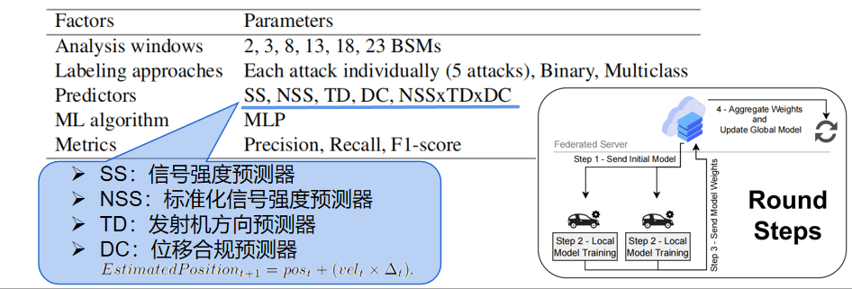

# Paper-Reading

Paper reading list in Cooperative perception. This repository will keep updating ... 🤗
- **L. Yang, A. Moubayed and A. Shami, "MTH-IDS: A Multitiered Hybrid Intrusion Detection System for Internet of Vehicles," in IEEE Internet of Things Journal, vol. 9, no. 1, pp. 616-632, 1 Jan.1, 2022, doi: 10.1109/JIOT.2021.3084796.[[paper]](https://ieeexplore.ieee.org/document/9443234)**

- **L. Yang, A. Shami, G. Stevens and S. de Rusett, "LCCDE: A Decision-Based Ensemble Framework for Intrusion Detection in The Internet of Vehicles," GLOBECOM 2022 - 2022 IEEE Global Communications Conference, Rio de Janeiro, Brazil, 2022, pp. 3545-3550, doi: 10.1109/GLOBECOM48099.2022.10001280.[[paper]](https://ieeexplore.ieee.org/document/10001280)**

- **L. Yang and A. Shami, "A Transfer Learning and Optimized CNN Based Intrusion Detection System for Internet of Vehicles," ICC 2022 - IEEE International Conference on Communications, Seoul, Korea, Republic of, 2022, pp. 2774-2779, doi: 10.1109/ICC45855.2022.9838780.[[paper]](https://ieeexplore.ieee.org/document/9838780)[[code]](https://github.com/Western-OC2-Lab/Intrusion-Detection-System-Using-CNN-and-Transfer-Learning)[[笔记]](<../../../车联网安全/detection/A Transfer Learning and Optimized CNN Based.docx>)**
   ```
   注：ICC 2022
   1. 研究背景与目的：
      - 现代车辆，包括自动驾驶和联网车辆，越来越多地连接到外部世界，这增加了车联网（IoV）的网络攻击面，使其更容易受到网络威胁。 
      - 现代车辆，包括自动驾驶和联网车辆，越来越多地连接到外部世界，这增加了车联网（IoV）的网络攻击面，使其更容易受到网络威胁。
      - 由于车载网络缺乏认证和加密程序，入侵检测系统（IDS）是保护现代车辆系统免受网络攻击的重要方法。
   2. 方法论：
      - 提出了一种基于迁移学习和集成学习的IoV系统IDS，使用卷积神经网络（CNN）和超参数优化技术。
      - 在实验中，所提出的IDS在两个知名的公共基准IoV安全数据集上展示了超过99.25%的检测率和F1分数。
   3. 创新点：
      - 提出了一种新的框架，通过CNN、迁移学习、集成学习和超参数优化技术有效检测车内外网络的网络攻击。
      - 提出了一种数据转换方法，将车辆网络流量数据有效地转换为图像，以便更容易区分各种网络攻击模式。
      - 在两个代表车内外网络数据的基准网络安全数据集上评估了所提出方法的性能，并与其他最先进的方法进行了比较。
   4. 具体实现步骤：
      - 收集车内外网络数据，将其转换为基于时间块的图像。
      - 使用五种先进的CNN模型（VGG16、VGG19、Xception、Inception和InceptionResnet）训练基础学习器。
      - 使用粒子群优化（PSO）方法优化CNN模型的超参数。
      - 选择表现最佳的三个CNN模型作为基础CNN模型，构建集成学习模型。
      - 使用置信度平均和连接两种集成策略构建最终的检测模型。
   ```

- **K. Agrawal, T. Alladi, A. Agrawal, V. Chamola and A. Benslimane, "NovelADS: A Novel Anomaly Detection System for Intra-Vehicular Networks," in IEEE Transactions on Intelligent Transportation Systems, vol. 23, no. 11, pp. 22596-22606, Nov. 2022, doi: 10.1109/TITS.2022.3146024.[[paper]](https://ieeexplore.ieee.org/document/9706416)[[code]](https://github.com/kushagra-2503/Artificial-Intelligence-Enabled-SecurityProvisioning-for-Autonomous-Vehicles)**
   ```
   注：TITS.2022
   1. 数据集：CAN-INTRUSION-DATASET
      - DoS attack
      - fuzzy attacks
      - gear attack
      - rpm attack
   2. 模型选择：
      - 正在使用的模型：Stacked LSTMS 和 CNN LSTMS
      - 对 6 个模型进行了实验：
         - 单层 LSTM
         - CNN + 单层 LSTM
         - 两层 LSTM
         - 三层 LSTM
         - 带 CNN 的三层 LSTM
         - 带 CNN 的四层 LSTM

   ```
- **薛宏伟.面向智能网联汽车的网络异常行为检测方法研究[D].东南大学,2021.DOI:10.27014/d.cnki.gdnau.2021.003115.[[paper]](https://kns.cnki.net/kcms2/article/abstract?v=yXT3uqWUX_-EDYP8LlA_mRorFVKfBHHJrzWvS9fHYuoFr84ZLVzX7GlDsnYFC0mT0mGXCXuae48zN2SBO9kC2ZwNpRwGz-dAk7if5vbghPdk39wRBcz_pAeQcMYTFXItFc9MiH0jSfrNKzjqucus7Q==&uniplatform=NZKPT&language=CHS)[[笔记]](<../../../车联网安全/detection/V2X Misbehavior Detection/面向智能网联汽车的网络异常行为检测方法研究note.md>)**
   ```
   注：2021年  
   核心内容：
   1. 异常行为检测方法：
      - 基于密码学的方法
      - 基于异常行为检测的方法，包括以节点为中心（Node-centric MDS）和以数据为中心（Data-centric MDS）的检测。
   2. 智能网联汽车网络安全模型建立：
      - 交通仿真模型
      - 车联网通信模块，包括通信数据格式的重新定义，考虑了位置、速度、加速度和航向的误差。
      - 网络攻击模式，包括单一攻击（拒绝服务、女巫攻击、重放攻击）和复合性攻击（DDS攻击）。
      - 智能网联汽车网络安全联合仿真，使用Veins和OMNeT++进行仿真。
   3. 基于Stacking集成学习的车联网异常行为检测方法：
      - 异常行为检测架构
      - 数据清洗和特征值筛选
      - 模型训练与测试
      - 使用常用评价指标（Accuracy、Precision、Recall、F1-Score）进行评估。
   4. 基于GAN网络的车联网异常行为检测方法：
      - 利用生成对抗式网络（GAN）学习Replay攻击的潜在分布，生成大量带标签的Replay攻击数据。
      - 通过GAN网络生成对抗样本，解决数据集中正常行为样本和异常行为样本数量不平衡的问题。
      - 性能比较，提出的方法在准确率、精确率和F1-Score上有所提升。
   5. 智能网联汽车的网络异常行为检测系统设计及实现：
      - 系统整体架构
      - 车载平台设计，包括在线和离线工作模式。
      - 云控平台设计，基于HTTP协议，实现全局网络状态分析。
      - 可视化模块设计，包括web界面和SUMO界面。
   6. 总结与展望：
      - 本文研究了智能网联汽车的网络攻击和异常行为检测方法。
      - 提出了基于Stacking集成学习和GAN网络的检测方法。
      - 未来研究可以扩展更多攻击方式，优化算法检测效果，并尝试引入深度卷积神经网络和更换损失函数以提升模型性能。
   ```
- **K. Agrawal, T. Alladi, A. Agrawal, V. Chamola and A. Benslimane, "NovelADS: A Novel Anomaly Detection System for Intra-Vehicular Networks," in IEEE Transactions on Intelligent Transportation Systems, vol. 23, no. 11, pp. 22596-22606, Nov. 2022, doi: 10.1109/TITS.2022.3146024.[[paper]](https://ieeexplore.ieee.org/document/9706416)[[code]](https://github.com/kushagra-2503/Artificial-Intelligence-Enabled-Security-Provisioning-for-Autonomous-Vehicles)**
   ```
   注：TITS.2022
   1. 数据集：CAN-INTRUSION-DATASET
      - DoS attack
      - fuzzy attacks
      - gear attack
      - rpm attack
   2. 模型选择：
      - 正在使用的模型：Stacked LSTMS 和 CNN LSTMS
      - 对 6 个模型进行了实验：
         - 单层 LSTM
         - CNN + 单层 LSTM
         - 两层 LSTM
         - 三层 LSTM
         - 带 CNN 的三层 LSTM
         - 带 CNN 的四层 LSTM

   ```

- **A. Boualouache and T. Engel, "A Survey on Machine Learning-Based Misbehavior Detection Systems for 5G and Beyond Vehicular Networks," in IEEE Communications Surveys & Tutorials, vol. 25, no. 2, pp. 1128-1172, Secondquarter 2023, doi: 10.1109/COMST.2023.3236448.[[paper]](https://ieeexplore.ieee.org/document/10015746)**
   ```
   注：IEEE Communications Surveys & Tutorials 2023
      这是一篇综述
   - 目前车联网MBDS攻击检测系统方案：
   1. 传统机器学习
   - 监督学习中的分类问题：朴素贝叶斯（NB）、Logistic回归（LR）、支持向量机（SVM）、k最近邻（KNN）、随机森林（RF）、人工神经网络（ANN）、额外树（ET）、AdaBoost、决策树桩、集成学习（bagging, boosting, stacking）、XGBoost、光梯度增强机（LGBM）
   - 无监督学习：异常检测、聚类和降维。常见的聚类算法是k均值模型、层次模型和高斯混合模型。常见的异常检测算法有椭圆包络算法、隔离森林算法、单类SVM算法。
   2. 深度学习
   - 监督学习：卷积神经网络（CNN）、递归神经网络（RNN）
   3. 高级机器学习概念
   - 联邦学习、强化学习、迁移学习、半监督学习、生成式对抗性网络（GAN）、线上学习
   ```
- **F. Dutra, K. Bonfim, C. Siqueira, L. A. Pereira, A. Santos and R. I. Meneguette, "DISMISS-BSM: an Architecture for Detecting Position Spoofing in Basic Safety Messages," GLOBECOM 2022 - 2022 IEEE Global Communications Conference, Rio de Janeiro, Brazil, 2022, pp. 3381-3386, doi: 10.1109/GLOBECOM48099.2022.10001122. [[paper]](https://ieeexplore.ieee.org/document/10001122)[[code]](https://github.com/c2dc/dismiss-bsm-globecom2022)**

   ```
   注：GLOBECOM.2022（MBDS检测）
   ```
- **K. A. Bonfim, F. D. S. Dutra, C. E. T. Siqueira, R. I. Meneguette, A. L. Dos Santos and L. A. P. Júnior, "Federated Learning-based Architecture for Detecting Position Spoofing in Basic Safety Messages," 2023 IEEE 97th Vehicular Technology Conference (VTC2023-Spring), Florence, Italy, 2023, pp. 1-5, doi: 10.1109/VTC2023-Spring57618.2023.10199980.[[paper]](https://ieeexplore.ieee.org/document/10199980)[[code]](https://github.com/c2dc/fl-bsm-vtc2023)**

   ```
   注：VTC2023-Spring（MBDS检测）
   ```
- **Misbehavior detection in intelligent transportation systems based on federated learning.
[[paper]](https://www.sciencedirect.com/science/article/pii/S2542660524000696)[[code]](https://github.com/Enrique-Marmol/Decentralized_Misbehavior_Detection_based_on_FL_for_Intelligent_Transportation_Systems)[[笔记]](<../../../车联网安全/detection/V2X Misbehavior Detection/2024_3区_基于联邦学习的智能交通系统中的不当行为检测.docx>)**
   ```
   注：2024年3区                                                     
   文章的创新点：
   1. 联邦学习的应用：文章提出了一种基于联邦学习的协作学习方法，用于车辆不当行为的检测。这种方法允许车辆在不共享其数据的情况下，通过本地训练更新全局模型，从而解决了传统集中式机器学习（ML）方法可能带来的隐私问题和高延迟问题。
   2. 数据集的重新平衡：文章使用了VeReMi数据集，并应用了SMOTE-Tomek技术来重新平衡数据集，以解决数据集中的类别不平衡问题。这种方法结合了过采样和欠采样，以确保每个类别的样本数量相对均衡，从而提高模型的泛化能力。
   3. 多层感知器（MLP）的优化：文章使用了优化的多层感知器（MLP）作为ML模型，并结合了FedAvg和Fed+两种聚合函数来评估模型性能。Fed+方法特别适用于处理非独立同分布（non-iid）的数据，这在实际的车辆通信场景中很常见。
   4. 模型性能评估：文章不仅使用了传统的准确率（accuracy）、召回率（recall）、精确率（precision）和F1分数等指标，还引入了Matthew相关系数（MCC）和Cohen's Kappa Score（CKS）来更全面地评估模型性能，特别是在类别不平衡的情况下。
   5. 同时，FL数据集划分通过id进行划分，比随机将数据集人为划分为多个数据集更加符合真实场景。
   ```
- **An Enhanced Model for Machine Learning-Based DoS Detection in Vehicular Networks.
[[paper]](https://ieeexplore.ieee.org/abstract/document/10186390)[[code]](https://github.com/ercansec/AttackDetectionMachineLearning)**
   ```
   注：2023年会议IFIP                                                     
   文章的创新点：
   1. 提出了一个新的机器学习模型检测车辆网络中的拒绝服务（DoS）攻击（数据集为VeReMi Extension）。
   2. 引入了适合车辆网络环境和DoS攻击的特征选择，包括发送者和接收者之间的相对位置、速度、加速度、航向等。
   3. 实现了数据采样方法，包括过采样和欠采样，以解决数据集不平衡问题，从而提高分类性能。
   4. 使用了集成学习（Ensemble Learning）技术，结合了提升（Boosting）、装袋（Bagging）和堆叠（Stacking）方法，以提高入侵检测系统（IDS）的性能。
   ```
- **Edge Computing-enabled Intrusion Detection for C-V2X Networks using Federated Learning.
[[paper]](https://ieeexplore.ieee.org/document/10001675)[[笔记]](<../../../车联网安全/detection/IDS/Edge Computing-enabled Intrusion Detection for.docx>)**
 
   ```
   注：GLOBECOM 2022                                                    
   文章的创新点：
   1. 利用边缘计算和联邦学习构建分布式入侵检测模型，以实现低延迟和高效的攻击检测。
   2. 使用CIC-IDS2018数据集进行特征工程，通过ANOVA方法选择最有信息量的特征，以提高模型性能。
   总结：
   介绍了一种基于边缘计算和联邦学习的分布式入侵检测系统（DID），用于车联网（C-V2X）网络。该系统旨在解决传统集中式入侵检测系统（IDS）在资源消耗和数据隐私方面的局限性。通过联邦学习，系统能够在多个分散的节点上协作训练全局机器学习模型，同时保持数据隐私并减少网络开销。选择了CIC-IDS2018数据集作为基础，该数据集包含了多种网络攻击场景。通过特征工程和ANOVA方法，系统仅考虑最具信息量的特征。
   ```
- **To Tolerate or To Impute Missing Values in V2X Communications Data?[[paper]](https://ieeexplore.ieee.org/document/9608954)**.
   ```
   注：IEEE Internet of Things Journal 一区 2022                                                    
   总结:
      本文探讨了在车联网（VANETs）中检测恶意行为时如何处理缺失值（接收到的数据可能由于各种原因而包含缺失值，诸如传感器读数中的错误、同步、传感器故障、通信故障和恶意攻击）的问题。作者提出了两种新的方法来处理不完整的V2X通信数据中的缺失值：一种是基于协作聚类的插补方法（COLI），另一种是基于随机子空间选择和Dempster-Shafer融合的缺失容忍方法（MTE-RD）。通过与现有的缺失值处理方法进行比较，作者开发了一个多因素截断框架（INSERT），以在V2X通信数据中系统地引入不同比例、机制和分布的缺失值，从而创建了一个全面的基准数据集。实验结果表明，MTE-RD方法在准确性和F-measure方面显著优于其他处理方法。
   创新点
   1. 提出了一种新的基于协作聚类的缺失值插补方法（COLI），这是首次开发协作聚类框架来插补缺失值。
   2. 提出了一种新的缺失容忍集成方法（MTE-RD），它使用随机子空间选择来形成特征子集，并训练个体分类器，然后通过Dempster-Shafer融合模块结合它们的输出。
   3. 开发了一个多因素截断框架（INSERT），用于在V2X通信数据中系统地引入缺失值，以模拟实际不完整的通信数据。
   ```

- **Proof of Travel for Trust-Based Data Validation in V2I Communication.[[paper]](https://ieeexplore.ieee.org/document/10017297)**
   ```
   注：IEEE Internet of Things Journal 一区 2023                                                    
   创新点：
   1. 提出了一种名为Proof of Travel (POT)的新型V2I通信协议，该协议利用路边基础设施支持，通过验证车辆的空间移动来确定每辆连接车辆的声誉。
   2. 设计了一种基于POT的投票游戏（PPV算法），用于增强现有的多数投票算法（如CPV），以验证V2I报告的交通事件。
   3. 使用博弈论框架证明了在采用PPV算法时，所有车辆选择作弊不是一个纯纳什均衡（NE），因为理性的对手会因为POT带来的额外成本而失去进行恶意行为的兴趣。
   4. 通过仿真实验表明，PPV算法能够容忍更高比例的恶意车辆，并比基准CPV算法产生更高的吞吐量。
   5. 提出了一种长期和短期激励设计，以鼓励车辆分享V2I数据，并在V2X生态系统中建立信任。
   实验步骤：
   1. 实验环境搭建：在V2X仿真运行时基础设施（VSimRTI）中实现POT协议和投票算法，并在怀俄明州的I-80州际公路上进行车辆仿真。
   2. 参数设置：根据实际的交通条件和V2X部署情况，设置仿真参数，包括车辆密度、RSU数量、VVMT阈值等。
   3. 安全性评估：通过比较RSU确认错误事件或未能报告实际发生事件的次数，来评估CPV和PPV算法对恶意报告的脆弱性。
   4. 性能评估：测量RSU运行投票算法的吞吐量，即每分钟正确事件的数量，并记录RSU确认事件所需的时间（延迟）。
   5. VVMT设计影响分析：研究不同VVMT实现（线性和逻辑形式）对车辆声誉的影响，并调整参数以控制车辆获得声誉的难度和速度。
   6. 安全性与性能权衡：在不同的交通密度和V2I数据关键性级别下，评估PPV算法在确保事件正确性和及时响应之间的权衡。
   7. 实验结果分析：根据仿真结果，分析PPV算法在不同参数设置下的性能，并与CPV算法进行比较。
   ```

- **Blockchain Assisted Hybrid Intrusion Detection System in Autonomous Vehicles for Industry 5.0[[paper]](https://ieeexplore.ieee.org/document/10266719)[[笔记]]([Title](../../../%E8%BD%A6%E8%81%94%E7%BD%91%E5%AE%89%E5%85%A8/detection/IDS/2023_Blockchain_Assisted_Hybrid_Intrusion_Detection_System_in_Autonomous_Vehicles_for_Industry_5.0(1).docx))**.
   ```
   注：IEEE Transactions on Consumer Electronics 二区 2023
   主题：提出了一种结合机器学习（ML）和区块链技术的混合入侵检测系统（BIDS），用于在工业5.0环境中提高自动驾驶车辆（AVs）的安全性。
   创新点：BIDS框架利用5G-V2X通信网络，提高了检测AVs中异常的准确性和速度，并结合区块链技术增强了信任评估，提高了IoV环境的安全性。
   详细步骤：通过模拟实验评估了BIDS框架的性能，包括对AVs的运动分析、BIDS的性能分析，以及与其他现有框架的比较。结果表明，BIDS在检测准确率方面达到了98%，并且在处理速度和安全性方面优于其他解决方案。
   ```
- **Meta-IDS: Meta-Learning Automotive Intrusion Detection Systems with Adaptive and Learnable[[paper]](https://assets.researchsquare.com/files/rs-3999020/v1_covered_050f41e2-4876-4edd-8d05-8da0278b7639.pdf?c=1709911730)[[code]](https://github.com/335659554/Meta-IDS)**
   ```
   注：2024
   总结：
   介绍了一种名为Meta-IDS的新型汽车入侵检测系统（Intrusion Detection System, IDS），该系统利用元学习（Meta-Learning）和Meta-SGD算法来增强对各种网络威胁的适应性。Meta-IDS特别关注低流量攻击的检测，这些攻击通常难以被传统IDS系统发现。通过双层优化技术，Meta-IDS能够在特定攻击场景中优化检测精度，并通过外部优化调整元参数以确保在不同场景中的泛化能力。此外，该系统还引入了攻击显著性得分（Attack Prominence Score, APS）来识别微妙的攻击模式，并通过实验结果证明了其在多种攻击场景中的高效性和适应性。
   
   创新点：
   1. 自适应和可学习的汽车IDS：Meta-IDS利用基于优化的元学习方法，特别是Meta-SGD算法，来提高对不同攻击场景的适应性，这是对现有IDS技术的重要补充。
   2. 双层优化技术：该系统采用双层优化技术，内部优化专注于特定攻击场景的检测精度，而外部优化则调整元参数以确保模型在不同场景中的泛化能力。
   3. 攻击显著性得分（APS）：为了模拟低流量攻击，Meta-IDS引入了APS，这是一种新的度量标准，用于准确区分低流量攻击。
   4. 实时车辆级评估：通过在Raspberry Pi 4上进行的评估，证明了Meta-IDS在实际车辆环境中的适用性和高效性。
   5. 低资源消耗：Meta-IDS在保持高检测性能的同时，其资源消耗低，平均处理时间仅为4.623毫秒，内存占用极小，适合实时检测。
   6. 适应不同攻击场景；低容量攻击的检测得到补充和重视，专注于低容量攻击来推进该领域，这是众所周知的难以检测，并且在以前的研究中基本上被忽视。

   实验步骤：
   1. 数据预处理：使用CAN Car-Hacking数据集进行训练和测试，对数据进行零填充、CAN ID转换、时间间隔替换、SMOTE过采样和Z-score标准化。
   2. 攻击模型和IDS部署场景：定义攻击模型，包括通过无线漏洞或物理访问控制ECU的攻击者，以及IDS在CAN总线上的部署位置。
   3. 神经网络结构：采用不同的神经网络结构，包括单层LSTM、CNN与单层LSTM的组合、双层堆叠LSTM以及CNN与双层堆叠LSTM的组合。
   4. 双层优化基于元学习：
   - 外部优化：调整元参数以优化模型在多种任务中的性能。
   - 内部优化：使用优化的学习率对模型参数进行微调，以适应特定任务。
   5. 性能分析：通过实验评估Meta-IDS在不同攻击场景下的性能，包括准确率、精确率、召回率、F1分数、CPU资源使用情况等。
   6. 与现有工作的比较：将Meta-IDS的性能与现有技术进行比较，证明了其在多种攻击类型上的优越性。
   7. 车辆级模型评估：在Raspberry Pi 4上进行实际车辆级别的评估，以验证Meta-IDS在实际车辆环境中的可行性和效率。
   ```

- **WIP: Modeling and Detecting Falsified Vehicle Trajectories Under Data Spoofing Attacks.[[paper]](https://www.ndss-symposium.org/wp-content/uploads/vehiclesec2024-35-paper.pdf)**
   ```
   注：2024
   攻击类型：
   1. 已知攻击：
   - ETA攻击：这种攻击通过发送伪造的轨迹信息，使得车辆的预计到达时间（ETA）比实际更长，从而影响交通控制系统的决策。文中提出了一个基于优化的模型来生成ETA攻击轨迹，考虑车辆动力学和邻近车辆的位置。
   - MSF攻击：这种攻击模拟了对多传感器融合（MSF）系统的欺骗，通过在GPS信号中添加偏差来误导车辆的定位和导航。文中提出了一种创新的建模范式来模仿MSF攻击行为，生成具有类似横向偏差模式的伪造轨迹。
   2. 未知攻击：
   VASP（V2X Application Spoofing Platform）平台中的68种典型V2X攻击。

   总结：
   本文提出了一种通用的异常检测模型，用于识别连接车辆（CV）和连接与自动化车辆（CAV）技术中的异常轨迹。通过模拟两种代表性的已知攻击行为，提出了一个基于交通和车辆领域知识的驾驶特征提取的异常检测框架。该框架结合了特征提取器和使用已知攻击轨迹训练的异常分类器，能够应用于识别由各种攻击生成的伪造轨迹。所提出的模型在检测已知和未知攻击的伪造攻击轨迹方面具有高准确性。

   创新点：
   1. 通用检测框架：提出了一个结合特征提取器和分类器的通用检测框架，可以针对不同的驾驶场景（如高速公路和信号化交叉口）进行定制，检测框架使用两种已知攻击进行训练，但可以检测其他未知攻击。。
   2. 特征集的提出：利用交通和车辆领域的知识，提出了一个有效表示正常驾驶行为的特征集。该特征集可以与不同的基于机器学习的分类器（如SVM、随机森林和决策树）结合使用，并在检测已知和未知攻击方面取得了高准确性。
   3. 新的攻击建模范式：提出了一种新的网络攻击建模范式，能够准确表示车辆级攻击行为，而无需构建复杂的攻击流程。与原始的MSF攻击模型相比，所提出的方法需要更少的计算资源，并且只需要GPS接收器的信息。

   实验步骤：
   1. 攻击建模：介绍了两种攻击（ETA攻击和MSF攻击）的建模方法，这两种攻击被认为是“复杂”的，因为它们考虑了车辆运动学的物理边界、车辆运动的一致性和交通流属性，大大增加了检测的难度。
      两种攻击模式：ETA攻击、MSF攻击
      - ETA攻击生成不遵守汽车跟随规则的伪造轨迹
      - MSF攻击生成围绕车道中心波动并逐渐偏离道路的伪造轨迹
   2. 特征提取器：设计了13个特征来捕捉正常驾驶的各个方面，包括纵向和横向驾驶行为。
         13个特征：平均加速度（绝对值）、平均航向率（绝对值）、平均车跟随距离差（绝对值）、平均速度、速度标准差、平均加速度、加速度标准差、平均航向率、航向率标准差、车跟随距离差异的平均值、车跟随距离差异的标准差、最大速度、最大加速度
   3. 异常检测框架：结合特征提取器和基于机器学习的异常分类器，设计了一个用于区分伪造轨迹的框架。使用收集到的ETA攻击轨迹和MSF攻击轨迹来训练异常分类器。
   4. 数值实验：在V2X应用欺骗平台（VASP）中建立了一个带有信号化交叉口的高速公路段，以生成攻击轨迹。使用VASP平台中的68种典型V2X攻击（包括基于运动学值的攻击和针对V2X应用的攻击）来测试所提出的模型的泛化性。
   5. 未来研究方向：计划在未来的工作中添加两种基线模型进行比较，包括基于合理性检查的模型和基于神经网络的模型。此外，还将探讨神经网络模型是否能够检测未知攻击，因为训练数据中提取的特征（即已知攻击）可能无法代表未知攻击中的异常模式。
   ```
- **Multi-Sensors Space and Time Dimension Based Intrusion Detection System in Automated Vehicles.[[paper]](https://ieeexplore.ieee.org/document/10224320)**
车辆数据集链接：[[数据集]](https://medium.com/udacity/open-sourcing-223gb-of-mountain-view-driving-data-f6b5593fbfa5)
   ```
   注：2024年2区
   1. 背景：现有的入侵检测机制往往无法有效识别通过同时攻击多个传感器来欺骗检测系统的协同攻击（confederate attack）。
   2. 贡献：提出的入侵检测系统整合了空间维度模型（Space Dimension Model）和时间维度模型（Time Dimension Model），基于传感器数据融合来对抗独立攻击和协同攻击。
      1. 空间维度模型：该模型利用车内多个传感器之间的多变量数据相关性作为输入，通过优化的卷积神经网络（CNN）模型进行处理。特别地，构建了车辆状态矩阵来表征每个传感器与其他传感器数据之间的底层相关性，并将这些矩阵输入到网络中进行分类。
      2. 时间维度模型：该模型设计用于描述由多变量传感器数据本身引起的突发偏差，通过利用马氏距离（Mahalanobis Distance, MD）度量来捕捉车辆状态向量在相邻时间的行为。
   3. 实验研究：通过基于真实世界车辆数据集的广泛实证研究，与仅考虑空间维度和时间维度的两种检测模型进行了比较分析。结果表明，所提出的集成异常检测机制在不同场景下的有效性，准确率提高了3.01%，F1分数提高了3.04%，并且能有效防御协同攻击。
   4. 主要贡献：
      - 开发了一个新颖的车辆入侵检测系统，集成了空间维度模型和时间维度模型。
      - 提出了一种基于CNN分类的通用入侵检测策略，适用于多变量车内传感器数据。
      - 在真实世界的车辆数据集上实施和评估了集成入侵检测机制，展示了其在不同攻击类型和幅度下的检测能力。
   ```
- **IIDS: Intelligent Intrusion Detection System for Sustainable Development in Autonomous Vehicles.[[paper]](https://ieeexplore.ieee.org/document/10144487)**
   ```
   注：2023年1区
   1. 问题：由于车辆网络（IVN）和外部车辆网络（EVN）缺乏认证和显著的安全机制，AVs容易受到网络攻击，如拒绝服务（DoS）、模糊攻击和欺骗攻击。
   2. 提出的系统：智能入侵检测系统（IIDS），该系统利用修改后的卷积神经网络（CNN）和超参数优化方法来增强IoV系统中的入侵检测和恶意AVs的分类。
   3. 主要贡献：
      - 通过数据转换方法有效地将车辆网络流量数据转换为图像，以便简单地区分不同的网络攻击模式。
      - 通过修改的CNN和超参数优化对恶意AVs进行分类。
      - IIDS框架采用去中心化的5G-V2X网络，使多个AVs能够通过传输警报消息来检测网络攻击，从而实现快速可靠的入侵检测。
   4. 实验结果：实验结果显示所提出的IIDS在检测攻击方面达到了98%的准确率。
   5. 未来工作：未来的工作可以探索将恶意AVs重新集成到网络中的各种方法，以及基于攻击模式的零日攻击检测和缓解策略。
   ```
- **X-CANIDS: Signal-Aware Explainable Intrusion Detection System for Controller Area Network-Based In-Vehicle Network.[[paper]](https://ieeexplore.ieee.org/document/10294210)**
数据集链接:[[数据集]](https://github.com/commaai/opendbc)
   ```
   注：2024年2区
   1. 提出的系统：提出了一个名为X-CANIDS的新型IDS，专为基于CAN的车辆网络设计。X-CANIDS通过使用CAN数据库将CAN消息的有效载荷分解成人类可理解的信号，从而提高了入侵检测性能。这些信号还使得能够理解哪个信号或ECU受到了攻击。能够检测零日攻击，因为它在训练阶段不需要任何标记的数据集。论文还通过在配备GPU的汽车级嵌入式设备上进行基准测试，证实了所提出方法的可行性。
   2. 实验结果：X-CANIDS在检测模糊测试、伪造攻击、重放攻击等方面表现出色，但在检测暂停攻击方面效果不佳。
   ```
- **Many-Objective Optimization Based Intrusion Detection for In-Vehicle Network Security.[[paper]](https://ieeexplore.ieee.org/document/10194469)**
车辆数据集链接：[[数据集]](http://ocslab.hksecurity.net/Dataset/CAN-intrusion-dataset)(来自2017年的一篇会议`OTIDS: A Novel Intrusion Detection System for
 In-vehicle Network by using Remote Frame`)
   ```
   注：2023年1区
   1. 研究目标：构建了一个多目标入侵检测模型，包括信息熵、准确率、误报率和异常检测响应时间作为四个目标，这些目标代表了影响入侵检测性能的关键因素。
   3. 提出的算法：论文设计了一个基于多目标优化的改进入侵检测算法，称为MaOEA-ID，用于优化检测模型参数。该算法具有双重进化选择机制：改进的差分进化算子产生内部种群的新后代，球形修剪机制选择优秀的内部解决方案形成外部存档的选择池。第二次进化选择产生存档的新后代，外部存档的存档选择机制在整个检测过程中选择和存储最优解。
   4. 实验验证：使用真实世界的车辆网络数据集进行了实验，以验证所提出的模型和算法的性能。
   5. 主要贡献：
   - 应用信息熵理论，构建了一个多目标CAN总线数据异常检测优化模型，以反映车辆网络的检测性能。
   - 设计了一个基于多目标的算法MaOEA-ID，通过内部和外部种群知识的进化融合，大大提高了算法性能。
   - 通过使用真实世界的车辆网络数据集进行的广泛模拟实验验证了所提出的模型和算法，证明了该方法在车辆网络入侵检测方面的优越性能。
   ```

😊😊(看过忘了)
- **A stacked ensemble learning IDS model forSoftware-defined VANET.[[paper]](https://arxiv.org/abs/2312.04956)**
   ```
   注：2023年12月14日发表 
   1. 研究背景与目的：
      - 针对软件定义的车载自组织网络（SDN-based VANET）中的入侵检测系统（IDS）进行研究，以提高对网络安全事件的检测和缓解能力。
      - 随着连接自动驾驶车辆（CAVs）的发展，评估传统IDS方法在新兴技术中的应用变得至关重要。
   2. 方法论：
      - 提出了一种堆叠集成学习方法，结合多种机器学习算法，以比单一算法方法更有效地检测威胁。
      - 使用CICIDS2017和VeReMi基准数据集进行性能比较，发现该方法在识别威胁方面更准确。
      - 方法还包括超参数优化和特征选择，以进一步提高性能。
   3. 结果与评估：
      - 研究结果表明，堆叠集成学习是一种有前景的技术，可以增强IDS的有效性。
      - 在CICIDS2017和VeReMi数据集上进行了二元和多类分类模型的性能评估，取得了高准确率、精确度、召回率和F1分数。
   4. 实施挑战与经验：
      - 在分类阶段，处理时间和硬件容量是主要挑战。
      - 提出了在SDN控制器中实施IDS解决方案的一般方法。
   5. 创新点：
      - 提出了一种新的SDN-based VANET异常检测模型，结合了不同的机器学习方法。
      - 实施了三阶段集成方法，减少了推断攻击的风险，并在小规模攻击上表现良好。
   6. 实施步骤：
      - 数据清洗和准备：处理缺失值，进行特征归一化。
      - 特征选择：使用SelectKBest类和卡方统计测试选择最佳特征。
      - 超参数优化：使用贝叶斯优化与高斯过程进行参数优化。
      - 集成堆叠分类器：使用随机森林（RF）和XGBoost作为基础学习器，逻辑回归（LR）作为最终学习器。
   ```
- **Federated Learning for V2X Misbehavior Detection System in 5G Edge Networks.[[paper]](https://dl.acm.org/doi/10.1145/3616388.3617533)**
   ```
   注：2023年10月30日至11月3日在国际ACM建模、分析和模拟无线与移动系统会议（MSWiM）上发表
   1. 研究背景与目的：
      - 5G蜂窝车联网（C-V2X）的出现为车联网（V2X）通信提供了主要技术，为电信服务提供商提供了利用现有5G网络基础设施的机会，以提供车到网络（V2N）服务。
      - 本文提出了一种新方法，通过在5G核心网络中实施联邦学习（Federated Learning）V2X不良行为检测系统，增强5G V2N服务的安全性。
   2. 方法论：
      - 提出的系统旨在保护位于5G边缘网络中的V2X应用服务器（V2X ASs）免受潜在的V2X攻击，同时利用联邦学习的隐私和可扩展性优势。
      - 通过广泛的仿真，将提出的模型与其他集中式和分布式方法进行比较，取得了优异的结果，证明了其部署的可行性。
   3. 结果与评估：
      - 提出的模型在准确性、精确度和检测率方面表现突出，分别达到了98.4%、99.3%和96.9%。
   4. 创新点：
      - 提出了一种基于长短期记忆（LSTM）和联邦学习的分布式不良行为检测系统，节点安装在5G边缘网络中，以保护边缘、云或互联网上托管的C-ITS应用服务器。
      - 利用联邦学习的可扩展性，解决了大规模部署中V2X不良行为检测的挑战。
   5. 具体实施步骤：
      - 在5G边缘网络中部署多个不良行为检测功能（MDFs）实例。
      - MDFs负责实时处理和监控V2N流量数据包，并将本地模型参数与联邦学习中心（FL-C）服务器共享，而不共享本地训练数据。
      - FL-C服务器作为中心枢纽，组织和编译从MDF实例接收到的改进机器学习模型，实现协作学习。
      - 在检测到攻击时，不良行为报告功能（MRF）可以启动流量引导请求，将攻击者的流量重定向到蜜罐服务器，保护应用免受伪造数据的影响。
   ```
- **An Amalgamated Novel IDS Model for Misbehaviour Detection using VeReMiNet.[[paper]](https://www.sciencedirect.com/science/article/pii/S0920548923000648)**
   ```
   注：2024年 2区《Computer Standards & Interfaces》
   1. 研究背景与目的：
      - 车辆自组织网络（VANETs）在智能交通系统（ITS）中越来越受欢迎，因为它们可以提高交通效率和道路安全。
      - 研究重点在于检测VANETs中传播虚假车辆信息（位置、时间、速度和车辆ID）的恶意节点，这些行为可能威胁网络安全和隐私，导致事故、碰撞和交通拥堵。
   2. 方法论：
      - 提出了一种基于深度学习（DL）的新方法，用于自动识别VANETs中的位置伪造攻击，以发现数据中的隐藏模式，对抗已知和新出现的威胁。
      - 使用公开可访问的VeReMi数据集评估方法，展示了高达99.55%的高检测准确率。
   3. 创新点：
      - 提出了一种新的DL驱动方法，自动检测基本安全消息中的威胁，与现有方法不同，后者仅使用单个基本安全消息的训练方面。
      - 提出了一种特征选择方法，使用教学-学习基础的海洋捕食者算法（MPA）进行特征选择，以提高检测精度。
      - 开发了一种深度学习模型，使用VeReMiNet准确分类所有类型的攻击。
   4. 具体实现步骤：
      - 初始化阶段：随机分配特征子集，计算每个特征子集的适应度，并创建精英和猎物矩阵。
      - 探索阶段：根据适应度值选择精英捕食者，并根据精英捕食者的位置调整捕食者的位置。
      - 捕食者和猎物速度相同（开发与探索）：在优化的中间阶段，捕食者和猎物以相同的速度移动，进行狩猎。
      - 猎物速度超过捕食者（开发）：在这个阶段，猎物通过Lévy飞行模式进行捕食，捕食者则通过Brownian运动进行捕食。
      - 海洋记忆捕食者：捕食者根据精英和猎物矩阵的适应度评估来改变精英，应用FADs（鱼群聚集装置）影响。
      - 分类使用VeReMiNet：使用深度学习模型对攻击进行分类，包括二元分类和多类分类。
   ```
- **R. Sedar, C. Kalalas, P. Dini, J. Alonso–Zarate and F. Vázquez–Gallego, "Misbehavior Detection in Vehicular Networks: An Ensemble Learning Approach," GLOBECOM 2022 - 2022 IEEE Global Communications Conference, Rio de Janeiro, Brazil, 2022, pp. 1850-1855, doi: 10.1109/GLOBECOM48099.2022.10001264.
[[paper]](https://ieeexplore.ieee.org/document/10001264)**
   ```
   注：GLOBECOM 2022
   1. 研究背景与目的：
      - 随着车联网（V2X）系统的兴起，需要新的机制来应对安全漏洞和安全威胁。
      - 本文介绍了一种数据驱动的集成框架，结合聚类和强化学习来检测未标记车辆数据中的不良行为。
   2. 方法论：
      - 提出了一种新的集成学习框架，用于V2X不良行为检测，该框架包括一个无监督学习层用于从未标记的V2X交通轨迹中发现隐藏模式，以及一个强化学习（RL）层，用于在未知的V2X环境中不断提高检测经验，而不依赖于安全阈值。
      - 使用K-means算法进行聚类和注释数据实例，然后训练一个基于RL的检测器来区分正常车辆和不良行为车辆。
   3. 创新点：
      - 结合了无监督学习和强化学习来处理未标记的数据，提高了对未知攻击模式的检测能力。
      - 在V2X环境中，通过实时反馈（奖励/惩罚）来学习最优的检测策略，使检测更加鲁棒，减少了对噪声训练数据的敏感性。
   4. 具体实现步骤：
      - 从原始V2X数据中检索消息（包括正常和攻击信息）。
      - 消息预处理，提取各种不良行为攻击类型的特征向量。
      - 无监督学习模块聚类并注释数据实例。
      - RL组件利用标记的数据实例来检测不良行为攻击类型。
   ```
- **R. Sedar, C. Kalalas, F. Vázquez-Gallego and J. Alonso-Zarate, "Reinforcement Learning Based Misbehavior Detection in Vehicular Networks," ICC 2022 - IEEE International Conference on Communications, Seoul, Korea, Republic of, 2022, pp. 3550-3555, doi: 10.1109/ICC45855.2022.9838796.[[paper]](https://ieeexplore.ieee.org/document/9838796)**
   ```
   注：ICC 2022
   1. 研究背景与目的：
      - 车联网（V2X）通信为实现未来车辆网络，如车联网（IoV），提供了支持，这有助于实现智能交通系统（ITS）的目标。
      - 恶意车辆传输错误/不正确的数据可能会对道路安全造成严重损害。因此，检测可能对道路用户造成损害的安全威胁信息至关重要。
   2. 方法论：
      - 提出了一种基于强化学习（RL）的V2X场景中的不良行为检测方法。
      - RL检测模型处理车辆广播的V2X数据作为路边单元（RSU）的时间序列，并将其分类为不良行为或正常行为。
   3. 创新点：
      - 将RL方法适应于V2X场景中的时间序列不良行为检测，提出了一种通用的基于RL的不良行为检测器。
      - 通过使用开源数据集进行扩展实验，展示了所提出的检测方案在检测各种攻击类型（如位置伪造、突然停止、DoS、Sybil等）方面的高效性。
   4. 具体实现步骤：
      - 在RSU中部署RL基础的不良行为检测器，作为与V2X环境互动的代理，学习最优检测策略。
      - 基于当前状态（st）在时间步t，代理执行动作（at）以最大化其奖励（rt）。
      - 环境根据代理的动作提供奖励，并随后转移到新状态（st+1）。
      - 通过经验回放记忆（experience replay memory）和Q-learning方法训练RL模型，以估计动作价值函数Q(s, a)。
      - 使用ϵ-greedy技术在Q-learning中平衡探索和利用策略。
      - 在边缘/云服务器上训练RL模型，假设其计算资源优于RSU，而在RSU级别执行检测。
   ```

