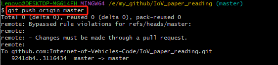
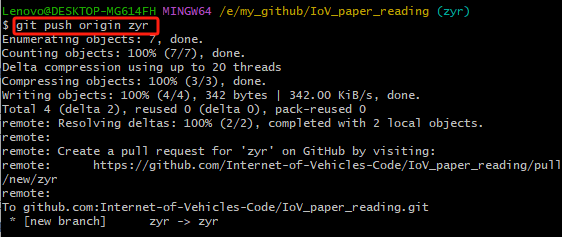
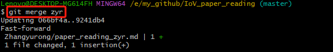
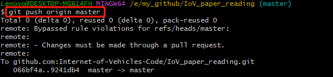

# IoV_paper_reading

本项目用于记录相关文献的阅读。

Our mission is to promote the security of Internet of Vehicles and autonomous driving.

People working on the paper reading program:
- [Zheng Xue](./Xuezheng/paper_reading_xz.md)
- [Yurong Zhang](./Zhangyurong/paper_reading_zyr.md)
- [Hongmin Wei](./Weihongmin/paper_reading_whm.md)

## 使用指南
- 各分支修改后上传到自己所在分支并合并到主分支操作
1. 克隆本项目
   ```
   git clone git@github.com:Internet-of-Vehicles-Code/IoV_paper_reading.git
   ```
2. 修改、更新内容
3. 添加到主分支
    ```
    git add .
    ```
4. 建立新分支zyr
    ```
    git checkout -b zyr
    ```
 5. 拉取最新主分支内容到zyr
    ```
    git pull origin master
    ```
    
6. 评论
    ```
    git commit -m "update..."
    ```
7. 上传到zyr
    ```
    git push origin zyr
    ```
    
8. 切换到主分支
    ```
    git checkout master
    ```
9. 在主分支中合并分支zyr
    ```
    git merge zyr
    ```
    
10. 更新推送到主分支
    ```
    git push origin master
    ```
    
