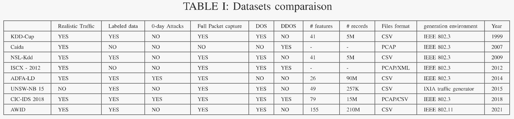

- **Edge Computing-enabled Intrusion Detection for C-V2X Networks using Federated Learning.
[[paper]](https://ieeexplore.ieee.org/document/10001675 )**
 
**注：GLOBECOM 2022**                                               
   1. 利用边缘计算和联邦学习构建分布式入侵检测模型，以实现低延迟和高效的攻击检测。
   2. 使用CIC-IDS2018数据集进行特征工程，通过ANOVA方法选择最有信息量的特征，以提高模型性能。
**总结：**
   解决传统集中式入侵检测系统（IDS）在资源消耗和数据隐私方面的局限性。通过联邦学习，系统能够在多个分散的节点上协作训练全局机器学习模型，同时保持数据隐私并减少网络开销。但引入联邦学习会增加系统的复杂性（其他文章看的）。

- **To Tolerate or To Impute Missing Values in V2X Communications Data?[[paper]](https://ieeexplore.ieee.org/document/9608954 )**.
**注：IEEE Internet of Things Journal 一区 2022**                                                    
**总结：**
   在车联网（VANETs）中检测恶意行为时如何处理缺失值（接收到的数据可能由于各种原因而包含缺失值，诸如传感器读数中的错误、同步、传感器故障、通信故障和恶意攻击）的问题。提出了两种方法来处理不完整的V2X通信数据中的缺失值。

- **Proof of Travel for Trust-Based Data Validation in V2I Communication.[[paper]](https://ieeexplore.ieee.org/document/10017297 )**
**注：IEEE Internet of Things Journal 一区 2023**（没看懂 没细看）                                                    
   1. 提出了一种名为Proof of Travel (POT)的新型V2I通信协议，该协议利用路边基础设施支持，通过验证车辆的空间移动来确定每辆连接车辆的声誉。
   2. 设计了一种基于POT的投票游戏（PPV算法），用于增强现有的多数投票算法（如CPV），以验证V2I报告的交通事件。
   3. 使用博弈论框架证明了在采用PPV算法时，所有车辆选择作弊不是一个纯纳什均衡（NE），因为理性的对手会因为POT带来的额外成本而失去进行恶意行为的兴趣。

- **WIP: Modeling and Detecting Falsified Vehicle Trajectories Under Data Spoofing Attacks.[[paper]](https://www.ndss-symposium.org/wp-content/uploads/vehiclesec2024-35-paper.pdf )**
**注：2024**
   攻击类型：
   1. 已知攻击：
   - ETA攻击：这种攻击通过发送伪造的轨迹信息，使得车辆的预计到达时间（ETA）比实际更长，从而影响交通控制系统的决策。文中提出了一个基于优化的模型来生成ETA攻击轨迹，考虑车辆动力学和邻近车辆的位置。
   - MSF攻击：这种攻击模拟了对多传感器融合（MSF）系统的欺骗，通过在GPS信号中添加偏差来误导车辆的定位和导航。文中提出了一种创新的建模范式来模仿MSF攻击行为，生成具有类似横向偏差模式的伪造轨迹。
   2. 未知攻击：
   VASP（V2X Application Spoofing Platform）平台中的68种典型V2X攻击。
**总结：**
   提出的异常检测模型用于识别连接车辆（CV）和连接与自动化车辆（CAV）技术中的异常轨迹。通过模拟两种代表性的已知攻击行为，提出了一个基于交通和车辆领域知识的驾驶特征提取的异常检测框架。该框架结合了特征提取器和使用已知攻击轨迹训练的异常分类器，能够应用于识别由各种攻击生成的伪造轨迹。特征集（13个特征：平均加速度（绝对值）、平均航向率（绝对值）、平均车跟随距离差（绝对值）、平均速度、速度标准差、平均加速度、加速度标准差、平均航向率、航向率标准差、车跟随距离差异的平均值、车跟随距离差异的标准差、最大速度、最大加速度）与不同的基于机器学习的分类器（如SVM、随机森林和决策树）结合使用。与原始的MSF攻击模型相比，所提出的方法需要更少的计算资源，并且只需要GPS接收器的信息。
  

  